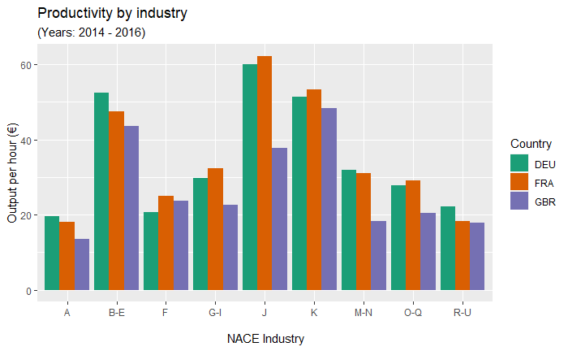

<style>
body {
text-align: justify}
</style>

```{r setup, include=FALSE}
# knitr::opts_chunk$set(echo = TRUE)
knitr::opts_chunk$set(echo = FALSE, fig.align = 'center')
```


# Introduction

### The business problem

*Productivity* is key to the development of local businesses and the wider economy. Over the past decade, productivity has slowed down globally with the UK lagging behind some other developed economies. 

This report *aims at* investigating the relationship between productivity and investment with an aim to improve productivity within Scotland and the UK overall. For this purpose, a range of countries were compared to understand the factors that influence both investment levels and productivity. 

Some targeted questions of interest for this specific project are listed below: 

1. Does government spending on factors such as *mental health*, *education*, and *research and development (R&D)* affect *productivity* in the UK? 

2. Is there a relationship between government *investment* and *productivity*? 

3. Can *investment* be used to predict *productivity*?


### Definition of productivity

Productivity is commonly defined as a ratio between the output volume and the volume of inputs. In other words, it measures how efficiently production inputs, 
such as labour and capital, are being used in an economy to produce a given level of output (refer to schematic in Figure 1).


```{r, echo = FALSE, fig.cap = "Figure 1: Productivity Explained (https://www.rba.gov.au/education/resources/explainers/productivity.html)", out.width = '50%'}
knitr::include_graphics("images/productivity_explained.jpg")
```

<br>
There are different measures of productivity and the choice between them depends either on the purpose of the productivity measurement and/or data availability. One of the most widely used measures of productivity is Gross Domestic Product (GDP) per hour worked. This measure captures the use of labour inputs better than just output per employee, as suggested by the Organisation for Economic Co-operation and Development (OECD)^[https://www.oecd.org/sdd/productivity-stats/40526851.pdf]. 


### Productivity and investment

An outline of the relationship between productivity and investment is provided below^[https://www.investopedia.com/terms/p/productivity.asp]: 

+ When productivity fails to grow significantly, it limits potential gains in wages, corporate profits, and living standards. Figure 2 explains schematically the impact of productivity to the economic welfare and prosperity of a country.  

+ Investment in an economy is linked to the level of savings because investment has to be financed from savings. 

+ Low savings rates can lead to lower investment rates and lower growth rates for labour productivity and real wages. 


```{r, echo = FALSE, fig.cap = "Figure 2: Benefits of Productivity Growth (https://www.rba.gov.au/education/resources/explainers/productivity.html)", out.width = '50%'}

```

# Context

### Business intelligence and data-driven decision making


The analysis presented in this report aims at providing useful insights towards a better understanding of the following:

+ Relationship between productivity and investment, which in turn will allow for predicting UK productivity based on investment.

+ Structural differences of UK productivity versus other high productivity countries.

<br>
The outcomes of the analysis are expected to help in:

+ Understanding why productivity growth has slowed down in the UK in recent years.

+ Providing a framework to investigate the effect of factors such as mental health and R&D in the UK productivity.

+ Providing a framework to accelerate productivity growth in Scotland and the UK overall.


### Domain knowledge and the business context

The analysis presented in this report is carried out on behalf of Deloitte, an international professional services network that provides audit, consulting, financial advisory, risk advisory, tax, and related services in different business sectors, including government^[https://www2.deloitte.com/uk/en/footerlinks1/about-deloitte.html]. 

Within the context of a consulting/financial advisory firm serving a public organisation, this analysis can potentially provide facts and insights on which Scotland and the UK in overall could base their management and policy decisions. This means that this work could be part of a country's initiative for shaping winning strategies, mobilising for change, building capabilities, and driving successful transformation and lasting improvements.


# Data

### Internal and external data sources

The data originally provided for this analysis was donated by Deloitte and can be found in the `master_data_files` folder inside the project's [GitHub repo](https://github.com/JohnHios/final_project_john_hios). The data come from the Equifax Ignite Direct data platform which hosts over 50 open data sources^[https://www.consumer.equifax.ca/equifaxignite/ignite-direct/].

Where possible, more recent versions of the data sets were sought in an effort to use the most up-to-date information for this report. If data more relevant to the scope of this work were identified in open databases, these were also considered in the analysis. 

As a result, out of the 9 files considered in the the analysis phase, only 2 files were classified as internal (provided by Deloitte) and the remaining 7 files were classed external (not sourced from Deloitte's data). These files can be found in the `raw_data` folder inside the project's [GitHub repo](https://github.com/JohnHios/final_project_john_hios). A summary of the files used is provided in the table below.


  Filename         | Brief Description | Periods of time  |  Format |  Source | Classification type
:-----------------:|:-----------------:|:----------------:|:-------:|:-------:|:-----------------:
OECD_Public_Spending_on_Education|Education expenditure (% GDP)  |  1995-2019 |   .csv | OECD |   external
OECD_Gross_Domestic_Product_GDP|Annual GDP in USD and USD per capita (current PPPs)  |  1960-2021 |   .csv | OECD |   external     
OECD_GDP_per_Hour_Worked |GDP per hour worked estimates  |  1970-2020 |   .csv | OECD |   external  
OECD_Investment_GFCF|Estimates of GFCF (Gross Fixed Capital Formation)  |  1960-2020 |   .csv | OECD |   external  
OECD_Hours_Worked|Total number of hours worked per year  |  1950-2020 |   .csv | OECD |   external 
OECD_Investment_by_Asset | Investment on assets (% GFCF)  |  1970-2021 |   .csv | OECD |   external
Data_Commons_Population_Trends | Eurostat regional population data |  1960-2019  |   .csv | Eurostat |   external
International_Labour_Productivity-Europe | Output per hour by industry in Euros  |  2014-2016  |   .xls | ONS |   internal  
Cross_country_Government-expenditure_on_mental_health | Mental health expenditure |  2011  |   .csv | WHO |   internal  


Note that,

+ OECD refers to the Organisation for Economic Co-operation and Development (https://www.oecd.org), and 

+ ONS refers to the Office for National Statistics (https://www.ons.gov.uk/)

+ WHO refers to the World Health Organisation (https://www.who.int/)


### Types of data

The data used in this analysis fall into the following types:

+ Categorical character type 
  + nominal: for instance country names, education type, investment sector and so on
  + ordinal: date-time

+ Numerical double type
  + discrete: years
  + continuous: financial indicators such as productivity, GDP, GFCF, education expenditure and so on


### Data formats

The format types of the data used in the analysis is shown in the table above. Out of the 9 files considered: 

+ 1 data file was in .xls format originating from ONS and provided by Deloitte.

+ 8 data files were in .csv format and downloaded from the OECD online data library.
 

### Data quality and bias

The available data contain historical records of cross-country productivity, other key quantities such as investment and education, and mental health expenditures.


####  Data quality issues

During an initial review of the data, the following were noticed:

1. The mental health dataset was limited in scope as there were no references for the UK, and only outdated information from 2011 was available for all other countries. As a result, the mental health data were not considered in this work. 

2. The public spending on education dataset had multiple missing values for the UK and several other countries (see Figure 3). Imputing the missing data with substitute values was not deemed appropriate, as this would distort the dataset. The subsequent steps in the analysis would not benefit from the induced bias and therefore it was decided to limit the scope of this dataset.  


```{r, echo = FALSE, fig.cap = "Figure 3: Missing values in UK public spending on education (% GDP)", out.width = '80%'}

```
<br>

#### Bias in data

A potential source of bias in the data is related to the calculation of the average hours worked per person across different countries. Bias in this calculation impacts he accuracy of the derived productivity (GDP per hour worked). In accordance to OECD, *labour force surveys (LFS)*^[https://www.oecd.org/sdd/productivity-stats/OECD-Productivity-Statistics-Methodological-note.pdf] are often used to work out the average hours worked per person. The main limitations of LFS are listed below:

+ It is a household survey and so may have limited consistency with output and value added measures collected in business surveys, especially by industry.
+ Concept of employment typically not be in line with the resident (domestic) concept in national accounts.
+ There may be reporting biases in reported hours worked, reflecting the self-reporting nature of LFS, and these biases, that may also be cultural, may have a significant impact on hours actually worked. 
+ Excludes people living in collective households, although this is unlikely to significantly affect numbers of persons employed.

To account for this kind of data bias, OECD and ONS rely on their own quality guidelines.

# Ethics

### Ethical issues in data sourcing and extraction

There are no ethical concerns regarding the sourcing and extraction of the datasets, as they have been acquired from open databases for the purpose of providing insights and strategies for improvement of governance and do not contain any Personal identifiable information (PII).

+ ONS collects data in line with their own data ethics policy   
(https://www.ons.gov.uk/aboutus/transparencyandgovernance/datastrategy/datapolicies/dataethicspolicy)

+ OECD works on government data of member countries in line with the Quality Framework for OECD Statistical Activities (https://www.oecd.org/sdd/qualityframeworkforoecdstatisticalactivities.htm)


### Ethical implications of business requirements

There are no ethical implications of the business requirements, as the data in this work are used for public benefit, and to deliver high quality public services and government.


# Analysis

### Stages in the data analysis process

The main stages in the data analysis process are the *data wrangling* and the *exploratory data analysis*, these are outlined in the schematic of Figure 4 below.

```{r, echo = FALSE, fig.cap = "Figure 4: Data wrangling and exploratory data analysis (https://r4ds.had.co.nz/wrangle-intro.html)", out.width = '60%'}
knitr::include_graphics("images/data_science_wrangle.png")
```
<br>
The *data wrangling* stage of the analysis consists of the following tasks:

+ Importing data.
+ Inspecting and tidying (cleaning) data.
+ Transforming data to more usable formats / joining different datasets.
+ Check for missing data by running missing data diagnostics.
+ Fixing any error and poorly formatted data elements.
+ Filtering/subsetting the data to prepare them for the exploratory analysis stage.  

The *exploratory data analysis* stage consists of the following tasks: 

+ Analysing and investigating the available data sets to discover significant correlations/patterns between productivity and investment in education and key assets.
+ Summarising the main characteristics of the productivity and investment in education and key assets using visualisation methods, such as:
  + Bar-plots 
  + Scatterplots 
  + Run charts (line graph of data over time) 
  + Colorpleth maps (graphical representation of data across geographical locations where values are depicted by colour).
+ Classification and graphical display of a multitude of countries in terms of productivity and investment via K-means clustering.
+ Linear regression modelling to determine the relationship between UK productivity and investment.


### Results

The data cleaning R scripts are available for review within the `scripts` folder inside the project's [GitHub repo](https://github.com/JohnHios/final_project_john_hios). The data visualisations (run charts, bar-plots, choropleth mapping) and the machine learning outputs (K-means clustering and linear regression modelling) are available for review in individual R notebooks within the `notebooks` folder.


#### UK productivity: A cross-country comparison

The UK productivity has consistently lagged behind a number of other advanced economies. This is demonstrated in Figure 5 where the productivity time series of the G-7 countries is shown. The key takeaways are:

+ For the past 20 years the UK productivity is sitting in the mid-range of the G-7 countries as it lags behind France, Germany and the USA but performs better compared to Canada, Italy and Japan. 
+ The UK productivity growth has slowed down significantly since the financial crisis of 2008^[https://www.historyextra.com/period/modern/financial-crisis-crash-explained-facts-causes/]. This has opened a up a large gap between anticipated and actual GDP per hour worked.


```{r, echo = FALSE, fig.cap = "Figure 5: Run chart of G-7 productivity trends (country names are per ISO 3166-1 alpha-3^[https://en.wikipedia.org/wiki/ISO_3166-1_alpha-3])", out.width = '80%'}

```

<br>

Note that even when the UK is compared to a broader set of OECD countries, the productivity is not ranking high as seen in Figure 6 below. 

```{r, echo = FALSE, fig.cap = "Figure 6: OECD cross-country productivity for 2020 (country names are per ISO 3166-1 alpha-3; UK is highlighted in red)", out.width = '80%'}

```

<br>

#### Relationship between productivity and investment

##### Cross-country comparison of UK economy

The UK population and economy size in terms of GDP is comparable to other leading advanced economies in Europe, such as France and Germany, as seen in Figure 7 and the table below. Note that the data are from 2018, but similar results can be derived for more recent years. 


```{r, echo = FALSE, fig.cap = "Figure 7: Map of European countries by share of their GDP in 2018 (where no data is available, countries are coloured in light grey; transcontinental countries are not included)", out.width = '90%'}

```

<br>

Country           | ISO 3166-1 alpha-3 | Population (million) | Nominal GDP in 2018 (trillion $) | Share of total GDP (%) 
:----------------:|:------------------:|:--------------------:|:--------------------------------:|:---------------------:
Germany           |  DEU               | 82.79                | 4.58                             | 16.05
United Kingdom    |  GBR               | 66.27                | 3.16                             | 11.08
France            |  FRA               | 66.92                | 3.13                             | 10.96
Italy             |  ITA               | 60.48                | 2.60                             | 9.11
Spain             |  ESP               | 46.66                | 1.90                             | 6.68


A closer observation of the French, German and UK economies shows that the UK productivity in key economic activities is shortfalling relative to France and Germany (refer to Figure 8). The aggregated productivity values for 2014-2016 show that the UK shortfall is more evident in the information and communication sector (NACE Industry Code J) and in the professional, scientific and technical activities (NACE Industry Code M-N).


```{r, echo = FALSE, fig.cap = "Figure 8: Comparison of French, German and UK productivity by NACE industry", out.width = '80%'}

```

<br>

The table below provides an explanation of the Statistical Classification of Economic Activities in the European Community also known as `NACE`^[https://en.wikipedia.org/wiki/Statistical_Classification_of_Economic_Activities_in_the_European_Community].

Code  | Description of Economic Activity
:----:|:-------------------
A     | Agriculture, forestry and fishing
B-E   | Industry (except construction)
F     | Construction
G-I   | Wholesale and retail trade, transport, accommodation and food service activities 
J     | Information and communication
K     | Financial and insurance activities
M-N   | Professional, scientific and technical activities; administrative and support service activities
O-Q   | Public administration, defense, education, human health and social work activities
R-U   | Arts, entertainment and recreation; other service activities


<br>

##### K-means clustering

To answer the business questions (1) and (2) posed in the `Introduction` section, the structural differences between the UK and leading advanced economies have to be understood first. 

For this purpose, data from 20 European countries were compared in terms of productivity and investment in education and key assets such as:

+ Intellectual Property Products (R&D, software & databases, literary and artistic originals, etc).
+ Dwellings (excluding land).
+ Cultivated biological resources (managed forests, livestock raised for milk production, etc).
+ Infrastructures (roads, bridges, airfields, dams, etc).
+ Transportation equipment (ships, trains, aircraft, etc).
+ Information & Communication Technology (software, hardware, databases, telecoms equipment, etc).

The analysis focused on year 2018, as there were no recent data in public education expenditure for the UK (refer to Figure 3). The dataset was partitioned using the K-means clustering algorithm^[https://en.wikipedia.org/wiki/K-means_clustering]. The optimal number of clusters was determined using the `silhouette` method and resulted in a total of 4 clusters which are listed below:

+ **Cluster #1**: Higher productivity economies of smaller EU countries and Scandinavia.
+ **Cluster #2**: Mid-range to low productivity EU economies.
+ **Cluster #3**: Italy, Spain and the UK (mid-range productivity).
+ **Cluster #4**: France and Germany (advanced productivity).

The scatterplots of Figure 9 display graphically the partitioning of the countries with respect to tertiary education and intellectual property expenditure. The key takeaways from these plots are:

+ Although the UK economy size is closer to that of France and Germany, in terms of productivity and investment it shows a very different profile, as it clusters with Italy and Spain.

+ Germany and France spend more money on education and intellectual property products (which also include R&D).


```{r, echo = FALSE, figures-side, fig.show="hold", fig.cap = "Figure 9: Grouping of European economies via K-means clustering (productivity vs education and intellectual property expenditure)", out.width = '80%'}
knitr::include_graphics(c("images/kmeans_productivity_vs_education_2018.png", "images/kmeans_productivity_vs_intellectual_property_2018.png"))
```

<br>

#### Productivity prediction modelling

To answer the business question (3) posed in the `Introduction` section, multiple linear regression modelling is used to predict UK productivity based on investment data. 

+ The 6 investment asset groups used previously in the K-means clustering were used as model predictors (that is, Intellectual Property Products, Dwellings, Cultivated biological resources, Infrastructures, Transportation equipment and Information & Communication Technology).  
+ Data from years 1995-2020 were used, due to unavailability of earlier Information & Communication Technology data (refer to Figure 10).
+ Education and mental health were not included in the model due to lack of sufficient data.


```{r, echo = FALSE, fig.cap = "Figure 10: Run chart of UK investment by asset", out.width = '85%'}

```

<br>

A genetic algorithm was used to identify the model below:
$$
\begin{aligned}
(GDP\,per\,hour\,worked\,$) = & \,\,31.08 \\ 
&  + 0.1261\times(Infrastructures\,$billion) \\ 
&  + 0.0498\times(Intellectual\,Property\,$billion) \\
&  + 0.2404\times(Dwellings\,$billion) \\ 
&  - 0.001338\times(Infrastructures\,$billion \times\,Dwellings\,$billion)
\end{aligned}
$$

Due to the limited amount of observations (25 in total), the model was cross-validated using a k-fold algorithm^[https://www.statology.org/k-fold-cross-validation-in-r/] with 10 folds (that is, k = 10).

The table below summarises the model performance in terms of variance explained by each regressor and goodness-of-fit via the Root Mean Square Error (RMSE) and the coefficient of determination (R^2^).
 
  Regressor term                   | Variance explained (%)
-----------------------------------|:----------:
Infrastructures                    | 33.92
Intellectual Property              | 18.23
Dwellings                          | 35.00
Infrastructures $\times$ Dwellings | 12.85
                                   |
**RMSE:** 0.593                    |
**R^2^:** 0.945                    |


The key takeaways from this analysis are:

+ Infrastructure and Dwelling investments seem to have the largest impact in the UK GDP per hour worked (approx. 34% and 35% respectively).

+ Investments in Intellectual property products in the UK accounts to a small portion of the UK productivity (approx. 18%).


### Tools for data analysis

The main tools used to carry out this analysis were:

+ **R**: Programming language for statistical computing and graphics - R version 4.1.2 (2021-11-01) -- "Bird Hippie" was used to run this analysis.
+ **RStudio**: Integrated development environment (IDE) for **R** - the regular desktop application release 2021.09.1+372 "Ghost Orchid" was used to run this analysis. 
+ **Rmarkdown**: Authoring framework for data science used for creating markdown documents - it was used for generating the final report.


### Descriptive, diagnostic, predictive and prescriptive analysis

The analysis completed falls under the following categories:

+ **Descriptive Analytics:** Current and historical data were used to identify trends and relationships between productivity and investment in key assets and education for a multitude of countries. A combination of visual displays, such as run charts and bar-plots were used to confirm that the UK productivity growth has slowed down significantly since the financial crisis of 2008. Colorpleth mapping was also used to compare the GDP share of countries across Europe. 

+ **Diagnostic Analytics:** K-means clustering was used to group the UK and several European countries according to their productivity and investment in key assets and education. Scatterplots were used to display graphically the outcome of the clustering process and provided insights on the why the UK productivity is lagging behind some other developed economies.

+ **Predictive Analytics:** Linear regression analysis was used to determine the relationship between UK productivity and investment in a historical context. A multiple regression model using 4 predictors and pairwise interactions was developed to measure how well the data fit that relationship. The model can be used to develop forecasts for the future. However the use of forecasting techniques for better decision making and formulating data-informed strategies was not pursued in this work.


# Conclusions

The main insights drawn from this analysis are listed below:

+ UK productivity growth slowed down after the financial crisis of 2008 and since then it is not ranking high compared to other countries.

+ Compared to France and Germany (countries similar in size of population and economy) productivity is notably lower in key economic activities.

+ Infrastructure and Dwelling investments seem to have the largest impact in the UK GDP per hour worked (approximate values 34% and 35% respectively).

+ Investments in Intellectual property products in the UK is lagging compared to Germany and France - it accounts to a small portion of the UK productivity (approximately 18%).

+ The UK Education investments are notably low compared to most higher productivity economies in Europe (latest data are from 2018) – lack of sufficient data didn’t allow for including this factor in the productivity prediction model.

+ Lack of adequate Mental Health data did not allow for any assessments of its impact in productivity.


# Recommendations

The following actions are recommended:

+ Investments in Education and key economic activities are vital to increasing productivity in the UK. 

+ A detailed study of the French and German economy may identify areas of improvement in the UK.

# Future Work

+ Acquisition of mental health info to answer the business question.

+ Explore alternative clustering methods for grouping data (for instance, ANN, distribution-based / density-based methods).

+ Detailed literature survey on predicting productivity using investment data with a view to:
  + Identify commonly used modelling approaches (Linear regression, time-series models, ANN etc).
  + Best modelling practices.


# References